**********************************************
# Ironman Kona 2019
**********************************************

#### Author: Chelsea Zaloumis
#### Galvanize DSI Capstone 1
*Last update: 7/20/2020*

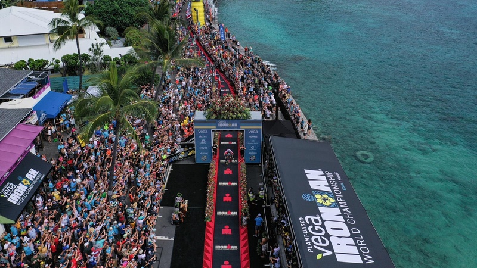

# Background & Motivation

The triathlon is arguably one of the most extreme and mentally taxing endurance sport competitions. Athletes train for years to complete the one-day competition consisting of a 2.4-mile (3.86 km) swim, a 112-mile (180.25 km) bicycle ride and a marathon 26.22-mile (42.20 km) run, raced in that order. Because a traithlon has three separate endurance sports, it begs the question, what comprises a strong Ironman athlete?

Every year since 1978, the World's craziest endurance athletes compete in the Kona Ironman World Championship (2020 being a COVID-exception). My goal is to explore the 2019 Ironman World Championship Results to determine which up and coming athletes sponsors should target and whether athletes hailing from specific backgrounds are more likely to perform well in an Ironman triathlon.

# Data

Kaggle has a dataset that includes the 2019 Ironman World Championship Results by athlete and includes the country they are representing, their category (Professional or Age Group), their overall placing, finish time, and swim / T1 / bike / T2 / run splits. 

# Exploratory Data Analysis

After importing my data using Spark, I quickly converted my data to pandas and using timecleaning.py, converted all timedate data types into minutes. I continued cleaning my data by eliminating athletes who did not finish race events and were therefore disqualified.

    class TimeDateToMinutes(object):
        '''
        Converts timedate columns to timedelta to seconds to minutes.
        '''
        def __init__(self, df, col1):
            self.df = df
            self.col1 = col1
            self._timedelt()
            self._seconds()
            self._minutes()
        
        def _timedelt(self):
            '''
            Convert cols to timedelta with units in seconds (timedelta puts in ns)
            '''
            self.df[[self.col1]] = self.df[self.col1].apply(pd.to_timedelta, unit='s')
    
        def _seconds(self):
            '''
            Converts df column from timedelta dtype to seconds
            '''
            self.df[self.col1] = self.df[self.col1].apply(lambda x: x.total_seconds())
    
        def _minutes(self):
            '''
            Converts df column from seconds to minutes
            '''
            self.df[self.col1] = self.df[self.col1].divide(60)

My first question was, do pro athletes have significantly different event split times based on their gender? Below are scatter plots for pro athletes on the left, and all amateurs on the right, by event type.

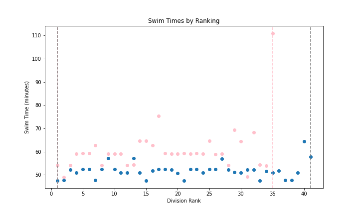 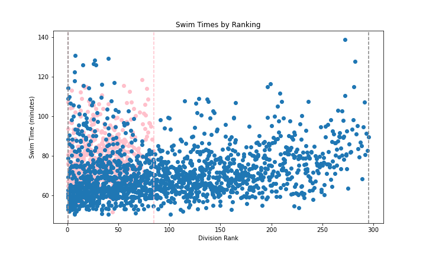

 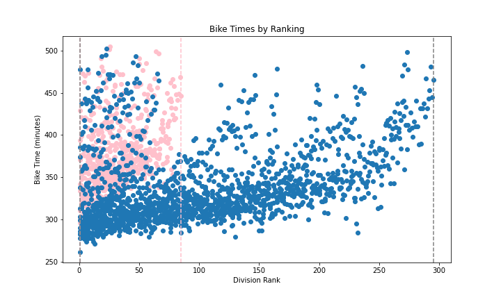

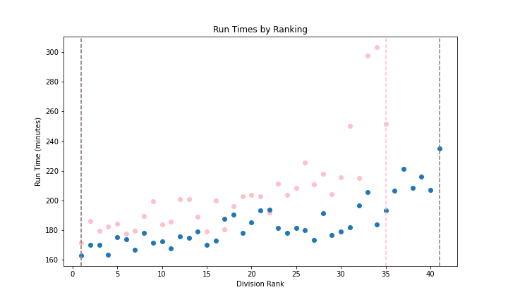 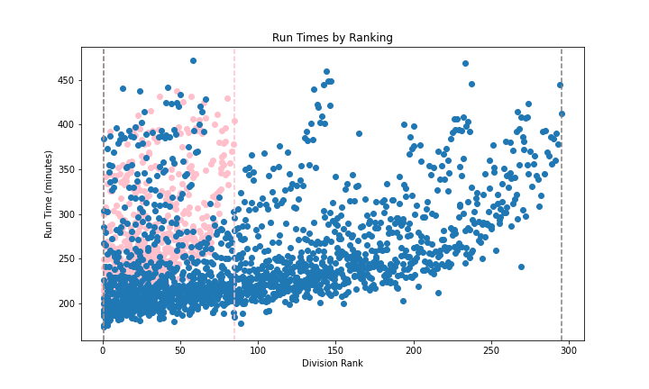

 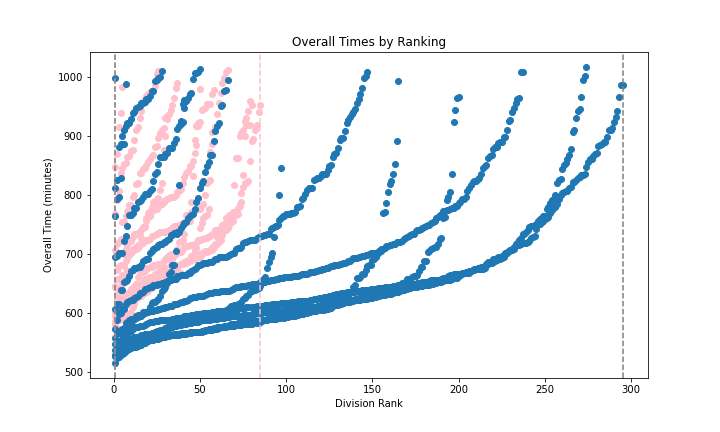

On average, do men race faster than women? Eyeing the scatter plots above, it would certainly seem so. To be certain, I conducted a two-sample, unpaired t-test on the pros and amateurs. My t-test states a null and alternative hypothesis as follows:

Null hypothesis: men and women mean racetimes are the same.

Alternative hypothesis: men and women mean racetimes are different, meaning one gender races faster than the other.

    t_statistic, pvalue = ttest_ind(male_pro['Overall'], fem_pro['Overall'], equal_var=False)

Pro t-test statistic: -7.76, Pro p-value: 5.156855215220441e-10

The large, negative t-test statistic value (-7.76) means there is a very big difference between the gender's mean overall times. The very small p-value allows us to reject the null hypothesis in favor of the alternative hypothesis. Therefore we can reason that pro male triathletes, on average, race faster than pro women triathletes. We can run a similar test on the amateur gender groups:

    t_statistic, pvalue = ttest_ind(male_agegroups['Overall'], fem_agegroups['Overall'], equal_var=False)

Amateur t-test statistic: -13.63, Amateur p-value: 3.889330523969423e-39

The amateur race times give us stronger reason to reject the null hypothesis and state that on average, male amateur triathletes compete faster than female amateur triathletes.

Next I plotted correlation heatmaps using the seaborn package to see what correlation split times have with division ranking. Again, we have the pro division on the left, and amateurs on the right.

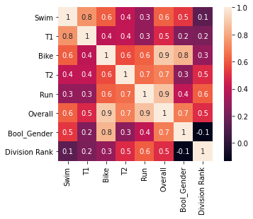 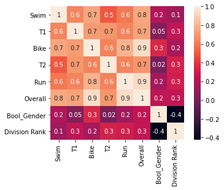

T2 and run times have the greatest correlations of all the events with how pros rank. This is important to note: pro athletes need to practice their transition from bike to running as well as perform their best in running to rank higher. 

In the amateur heatmap, we can see swim has the same correlation with division rank as in the pro's heatmap. This low correlation leads us to assume that swim times do not have a big affect on how an athlete ranks. Therefore they should practice the other sports and transitions if they want to rank higher, not swimming since it so lowly correlates with division rank. However both transitions for amateurs are very important to practice as they hold the same correlation as the run event with rank.

Both heatmaps include a Bool_Gender column where female athletes result in True and male in False. the negative correlation we see in both heatmaps supports evidence from the previous scatter plots and t-tests that female athletes race slower and rank lower than male athletes, on average.

# Up & Coming Athletes

Of the amateurs, who's racing as fast as the pros and which amateur athletes should sponsors sign? To answer this, I bootstrapped the 90th percentile of pros in both genders and used a 95% confidence interval to determine the "slower" pros in event times. The following code returns a random array of event times, bootstraps any statistic provided by numpy, and then plots the pro 90th percentiles with 95% confidence intervals.

    def times(df, sport):
        '''
        Returns an array of randomly chosen times according to the sport specified.
    
        Parameters:
        df: dataFrame pulling from
        sport: string: 'Swim', 'Bike', 'Run', or 'Overall'
    
        Returns:
        np.array of length 2434, with time entries in minutes
        '''
        l = df[sport]
        return np.random.choice(df[sport], size=len(l), replace=True)
        
    def bootstrap_statistic(df, sport, samples, statistic):
        '''
        Returns an array of bootstrapped statistics

        Parameters:
        df: dataFrame pulling from
        sport: string: 'Swim', 'Bike', 'Run', or 'Overall'
        samples: int: # of samples desired
        statistic: string: statistic to calculate on sample i.e. np.median, np.var, np.std
        '''
        statistics = []
        for i in range(samples):
                samp = times(df, sport)
                statistics.append(statistic(samp))
        return statistics
    
    def bootstrap_percentile(df, sport, samples, percent, statistic=np.percentile):
        '''
        Returns an array of bootstrapped percentiles

        Parameters:
        df: dataFrame pulling from
        sport: string: 'Swim', 'Bike', 'Run', or 'Overall'
        samples: int: # of samples desired
        statistic: np.percentile
        '''
        statistics = []
        for i in range(samples):
            samp = times(df, sport)
            statistics.append(statistic(samp, percent))
        return statistics

    def plot_pro_90(sport, df1=fem_pro, df2=male_pro):
        # Generate bootstrap 90th percentiles
        fem_90p = bootstrap_percentile(df1, sport, 1000, 90)
        male_90p = bootstrap_percentile(df2, sport, 1000, 90)

        # Say it with confidence
        left_f90p = np.percentile(fem_90p, 2.5)
        right_f90p = np.percentile(fem_90p, 97.5)

        left_m90p = np.percentile(male_90p, 2.5)
        right_m90p = np.percentile(male_90p, 97.5)

        # Plot it
        fig, ax = plt.subplots(1, figsize=(12,4))
        ax.hist(fem_90p, bins=50, density=True, color='pink', alpha=0.8, label=f'Female Pro {sport} 90th Percentile')
        ax.hist(male_90p, bins=50, density=True, color='b', alpha=0.7, label=f'Male Pro {sport} 90th Percentile')
        ax.legend()

        ax.set_title(f'Pro {sport} 90th Percentiles', fontsize=20)
        ax.set_xlabel(f'{sport} Time (minutes)', fontsize=15)

        ax.axvline(left_f90p, c='pink', linestyle="--")
        ax.axvline(right_f90p, c='pink', linestyle="--")
        ax.axvline(left_m90p, c='grey', linestyle="--")
        ax.axvline(right_m90p, c='grey', linestyle="--")

        print(f'Female Pro {sport} Times Bootstrap Confidence Interval for Population 90th Percentile (minutes): [{round(left_f90p, 2)}, {round(right_f90p,2)}]')
        print(f'Male Pro {sport} Times Bootstrap Confidence Interval for Population 90th Percentile (minutes): [{round(left_m90p, 2)}, {round(right_m90p,2)}]')

        return fig, ax

Female Pro Swim Times Bootstrap Confidence Interval for Population 90th Percentile (minutes): [62.75, 75.4]

Male Pro Swim Times Bootstrap Confidence Interval for Population 90th Percentile (minutes): [52.38, 57.83]

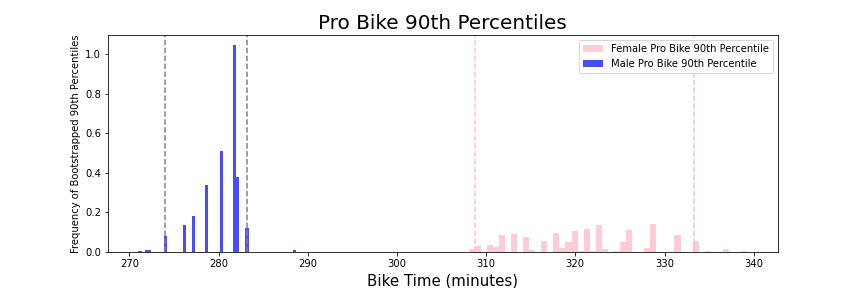

Female Pro Bike Times Bootstrap Confidence Interval for Population 90th Percentile (minutes): [310.11, 333.25]

Male Pro Bike Times Bootstrap Confidence Interval for Population 90th Percentile (minutes): [273.95, 283.17]

Female Pro Run Times Bootstrap Confidence Interval for Population 90th Percentile (minutes): [211.39, 297.6]

Male Pro Run Times Bootstrap Confidence Interval for Population 90th Percentile (minutes): [193.28, 221.37]

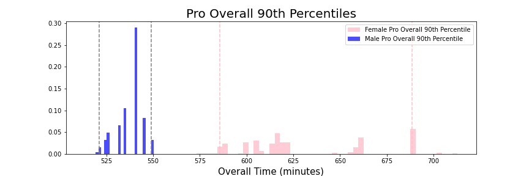

Female Pro Overall Times Bootstrap Confidence Interval for Population 90th Percentile (minutes): [585.6, 688.37]

Male Pro Overall Times Bootstrap Confidence Interval for Population 90th Percentile (minutes): [521.32, 548.9]

The following code plots the amateur event times with the pro 95% confidence interval for their 90th percentile so we can look at what amateurs are racing like the slower pros.

    def plot_amateur_proci(sport, df1=fem_agegroups, df2=male_agegroups, df3=fem_pro, df4=male_pro):
        # Convert Amateur times to minutes
        f_agegroups_ = df1[sport] / 60
        m_agegroups_ = df2[sport] / 60

        # Generate pro bootstrap 90th percentiles
        fem_90p = bootstrap_percentile(df3, sport, 1000, 90)
        male_90p = bootstrap_percentile(df4, sport, 1000, 90)

        # Say it with confidence
        left_f90p = np.percentile(fem_90p, 2.5) / 60
        right_f90p = np.percentile(fem_90p, 97.5) / 60

        left_m90p = np.percentile(male_90p, 2.5) / 60
        right_m90p = np.percentile(male_90p, 97.5) /60

        # Plot it
        fig, ax = plt.subplots(1, figsize=(12,4))

        ax.hist(m_agegroups_, bins=100, density=True, color='grey', alpha=0.75, label=f'Male Amateur {sport} Times')
        ax.hist(f_agegroups_, bins=100, density=True, color='pink', alpha=0.75, label=f'Female Amateur {sport} Times')
        ax.axvline(left_f90p, c='red', linestyle="--", label='Female Pro 90 Percentile')
        ax.axvline(right_f90p, c='red', linestyle="--")
        ax.axvline(left_m90p, c='black', linestyle="--", label='Male Pro 90 Percentile')
        ax.axvline(right_m90p, c='black', linestyle="--")
        ax.legend()

        ax.set_title(f'How do Amateurs Compare to the Pro {sport} 90th Percentile?', fontsize=20)
        ax.set_xlabel(f'{sport} Time (minutes)', fontsize=15)

        m_ = m_agegroups_[m_agegroups_ <= right_m90p]
        f_ = f_agegroups_[f_agegroups_ <= right_f90p]
        mam_pros_ = round((len(m_) / len(m_agegroups_))*100, 2)
        fam_pros_ = round((len(f_) / len(f_agegroups_))*100, 2)
        print(f'Percent of male amateurs who {sport} like pros: {mam_pros_}%')
        print(f'Percent of female amateurs who {sport} like pros: {fam_pros_}%')

        return fig, ax

To save space, we'll only look at the percentages of amateurs who race like pros for the rest of the sports.

    Does it need a header?
    
    | Event | Gender | % Racing like Pros |
    | --- | --- | --- |
    | Swim | Female | 48.52% |
    | Swim | Male | 8.28% |
    | Bike | Female | 11.69% |
    | Bike | Male | 1.74% |
    | Run | Female | 72.43% |
    | Run | Male | 37.09% |
    | Overall | Female | 36.47% |
    | Overall | Male | 2.74% |

Now we'll look at the top performing (10th percentile) amateurs and map them next to the pros 95% confidence interval 90th percentiles.

    def plot_cis(sport, df1=fem_agegroups, df2=male_agegroups, df3=fem_pro, df4=male_pro):    
        # Bootstrap amateur 10th percentiles
        fem_10 = bootstrap_percentile(df1, sport, 1000, 10)
        male_10 = bootstrap_percentile(df2, sport, 1000, 10)

        # Say it with confidence
        left_f10 = np.percentile(fem_10, 2.5)
        right_f10 = np.percentile(fem_10, 97.5)
        left_m10 = np.percentile(male_10, 2.5)
        right_m10 = np.percentile(male_10, 97.5)

        # Generate pro bootstrap 90th percentiles
        fem_90 = bootstrap_percentile(df3, sport, 1000, 90)
        male_90 = bootstrap_percentile(df4, sport, 1000, 90)

        # Say it with confidence
        left_f90 = np.percentile(fem_90, 2.5)
        right_f90 = np.percentile(fem_90, 97.5)
        left_m90 = np.percentile(male_90, 2.5)
        right_m90 = np.percentile(male_90, 97.5)

        # Plot it
        fig, ax = plt.subplots(1, figsize=(12,4))

        ax.hist(male_10, bins=100, density=True, color='grey', alpha=0.75, label=f'Male Amateur {sport} 10 Percentiles')
        ax.hist(fem_10, bins=100, density=True, color='pink', alpha=0.75, label=f'Female Amateur {sport} 10 Percentiles')
        ax.axvline(left_f90, c='red', linestyle="--", label='Female Pro 90 Percentile')
        ax.axvline(right_f90, c='red', linestyle="--")
        ax.axvline(left_m90, c='black', linestyle="--", label='Male Pro 90 Percentile')
        ax.axvline(right_m90, c='black', linestyle="--")
        ax.legend()

        ax.set_title(f'How does the {sport} Amateur 10th Percentile Compare to the Pro 90th Percentile?', fontsize=20)
        ax.set_xlabel(f'{sport} Time (seconds)', fontsize=15)

        return fig, ax

## References
Dataset: https://www.kaggle.com/andyesi/2019-ironman-world-championship-results

- - -
* notes *
-who is interested in this data?
-sponsors for up and coming athletes? sponsoring high ranking amateurs => more exposure and approachability
