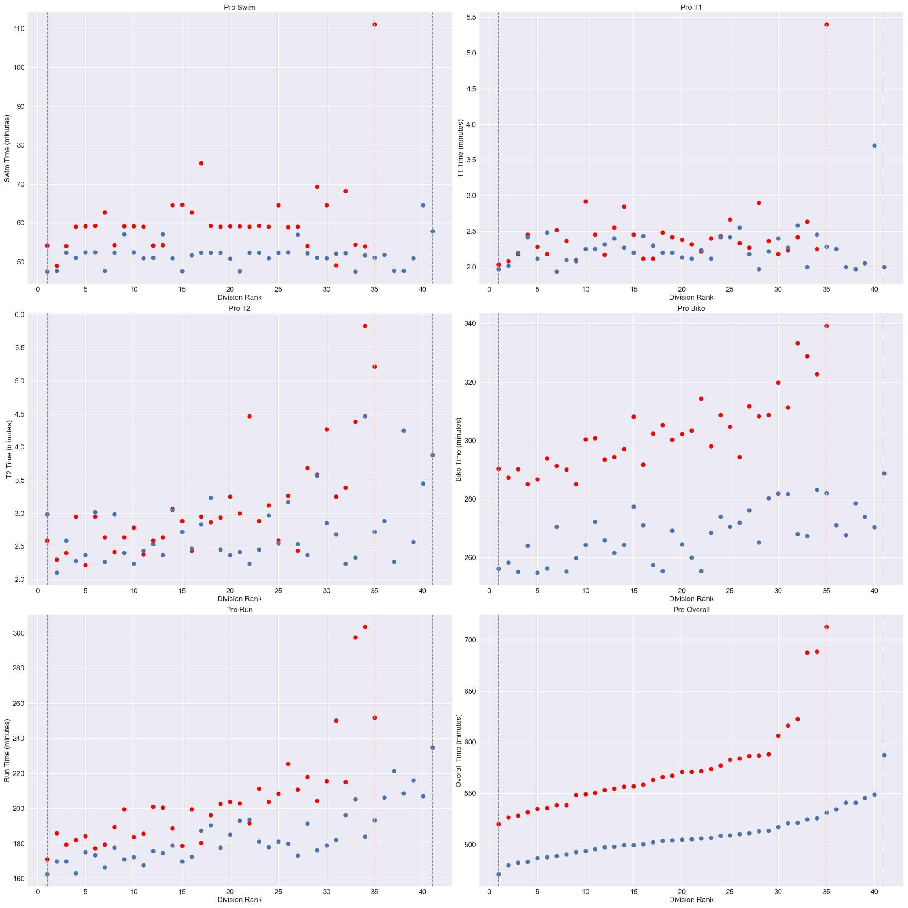
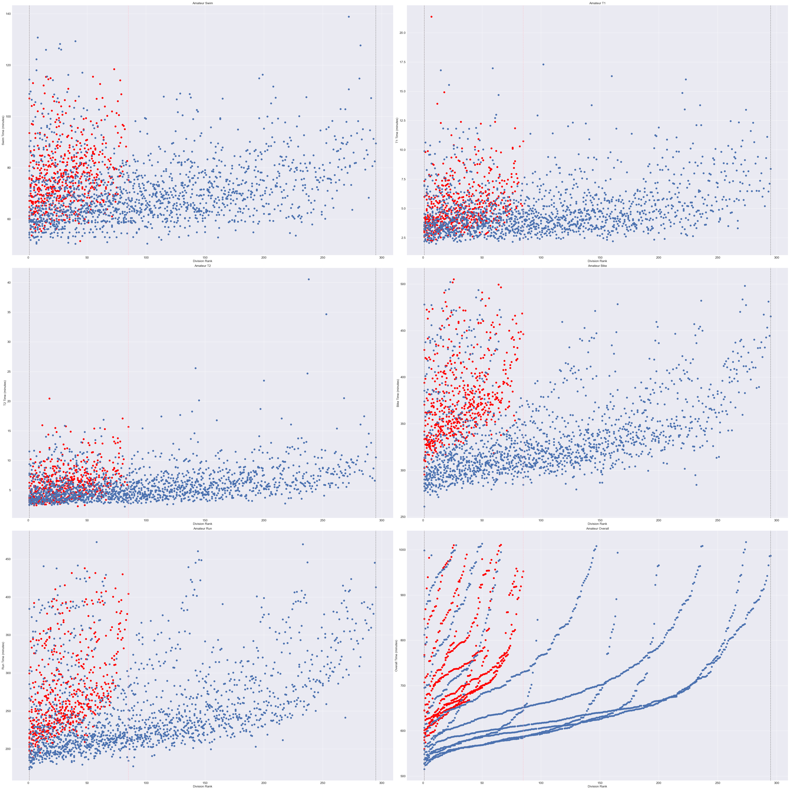

**********************************************
# Kona Ironman 2019
**********************************************

#### Author: Chelsea Zaloumis
#### Galvanize DSI Capstone 1
*Last update: 7/20/2020*

# Background & Motivation

The triathlon is arguably one of the most extreme and mentally taxing endurance sport competitions. Athletes train for years to complete the one-day competition consisting of a 2.4-mile (3.86 km) swim, a 112-mile (180.25 km) bicycle ride and a marathon 26.22-mile (42.20 km) run, raced in that order. Because a traithlon has three separate endurance sports, it begs the question, what comprises a strong Ironman athlete?

Every year since 1978, the World's top (craziest) endurance athletes compete in the Kona Ironman World Championship (2020 being a COVID-exception). My goal is to explore the 2019 Ironman World Championship Results to determine which up and coming athletes sponsors should target and whether athletes with specific strengths are more likely to perform well in an Ironman triathlon.

# Data

I used a Kaggle dataset of the 2019 Ironman World Championship Results, which is linked in references. Rows are entries by athlete and include the country they are representing, their category (Professional or Age Group), their overall placing, finish time, and swim / T1 / bike / T2 / run splits. The dataset originally consisted of 14 columns and 3,045 rows or athletes.

All of the time categories and rankings were in string format. I formatted the event times to a float: i.e. converted string format of 'datetime' to minutes. I then cast the rank columns to integers. I continued cleaning my data by eliminating athletes who did not finish race events and were therefore disqualified as well as the BIB column. Resulting cleaned data and datatypes:

| Name | Country | Gender | Division | Swim | Bike | Run | Overall | Division Rank | Gender Rank | Overall Rank | T1 | T2 |
| ---- | ---- | ---- | ---- | ---- | ---- | ---- | ---- | ---- | ---- | ---- | ---- | ---- | 
| object | object | object | object | float64 | float64 | float64 | float64 | int64 | int64 | int64 | float64 | float64 | 

# Exploratory Data Analysis

My initial question: do ironman athletes have significantly different event times based on their gender? Below are scatter plots for pro athletes and amateurs

 

On average, do men race faster than women? Eyeing the scatter plots above, it would certainly seem so. To be certain, I conducted a two-sample, unpaired t-test on the pros and amateurs. My t-test states a null and alternative hypothesis as follows:

* Null hypothesis: men and women mean racetimes are the same.

* Alternative hypothesis: men and women mean racetimes are different, meaning one gender races faster than the other.

        Pro t-test statistic: -7.76, Pro p-value: 5.156855215220441e-10

The very small p-value allows us to reject the null hypothesis in favor of the alternative hypothesis. Therefore we can reason that pro male triathletes, on average, race faster than pro women triathletes. We can run a similar test on the amateur gender groups:

        Amateur t-test statistic: -13.63, Amateur p-value: 3.889330523969423e-39

The amateur race times give us stronger reason to reject the null hypothesis and state that on average, male amateur triathletes compete faster than female amateur triathletes.

Next I plotted correlation heatmaps using the seaborn package to see what correlation split times have with division ranking. Again, we have the pro division on the left, and amateurs on the right.

 

  * T2 and run times have the greatest correlations of all the events with how pros rank.
  * Therefore pro athletes need to practice their transition from bike to running as well as perform their best in running to rank higher. 

  * Swim has the lowest correlation (although still correlated) than the other events, therefore swim times do not have as big affect on how an athlete ranks.Athletes should practice the other sports and transitions if they want to rank higher.
  * Both transitions for amateurs are very important to practice as they hold the same correlation as the run event with rank.

  * Both heatmaps include a Bool_Gender column where female athletes result in True and male in False. The negative correlation in both heatmaps supports evidence from the previous scatter plots and t-tests that female athletes race slower and rank lower than male athletes, on average.

# Up & Coming Athletes

Of the amateurs, who's racing as fast as the pros and which amateur athletes should sponsors sign? To answer this, I bootstrapped the 90th percentile of pros in both genders and used a 95% confidence interval to determine the "slower" pros in event times.

| Event | Gender | 95% CI on 90th Percentile (min) | % Amateurs in 95% CI |
| ---- | ---- | :----: | :----: |
| Swim | Female | [62.75, 75.4] | 48.52% |
| Swim | Male | [52.38, 57.83] | 8.28% |
| Bike | Female | [310.11, 333.25] | 11.69% |
| Bike | Male | [273.95, 283.17] | 1.74% |
| Run | Female | [211.39, 297.6] | 72.43% |
| Run | Male | [193.28, 221.37] | 37.09% |
| Overall | Female | [585.6, 688.37] | 36.47% |
| Overall | Male | [521.32, 548.9] | 2.74% |

I visualized this data with the following plots of bootstrapped top performing (10th percentile) amateurs with the pro's 90th percentiles (with 95% confidence of course).

The top agegroupers (amateurs) are listed here by gender. After researching, I found many of these athletes were top competitors and pro at one point, or hold agegroup championships already!

 

# What type of athlete performs well in an Ironman Triathlon?

To answer this question, I standardized each event time (swim, bike, run) to compare how many standard deviations each athlete's time is from that category's mean time. Displayed below is each athlete's "consistency factor" to illustrate how consistently well, or poorly, athletes' event times are.

Not surprisingly, the more consistently fast their event times, the higher ranking an athlete.

We can look at each division's consistency as well to see what agegroup holds the "all-around" athletes.

Eyeing this plot, male pros and males 30-39 perform the most consistently well in their respective divisions, and overall. This supports previous knowledge (not explored in this study) claiming that 30-39 is the prime age for triathletes because of how long it takes to train your body to compete in long endurance races.

Next I looked at how specialized an athlete is in a given event by defining their event specializations as the difference of the event in question from the mean of the other two events. I then plotted the pro's specializations and their rank to give us a better idea on which events the pros focus on to become the best.

Observations:
  * I confirmed the original correlation matrix findings that show swim does not correlate as strongly with ranking and therefore should not be a focus in training.
  * Running and biking are more so correlated with athlete rank.
  * Male pros are incredibly specialized bikers and less so runners.
  * Female pros specialize in running over biking.
  * Specializing in both running and biking lead to a higher rank because of the events' percentages of overall time.

I reaffirmed these observations by plotting specialization by rank for each gender's division:

 

To test these observations, I divided my dataframe into three separate dataframes, each with only the highly specialized athletes in the respective three events. I conducted a two-sample, unpaired t-test of each dataframe against dataframes with the respective event's low specialize scores. My t-test states a null and alternative hypothesis as follows:

Null hypothesis: Athletes who specialize in a certain event do not have greater or lesser overall times than the mean of those who do not specialize.

Alternative hypothesis: Athletes who specialize in a certain event have overall competition times that are greater, or smaller than the mean of overall times of athletes who do not specialize.

| Event | P-value | T-test Statistic |
| ---- | ---- | :----: |
| Swim | 9.508630443559785e-14 | 7.5 |
| Bike | 4.492361692476316e-12 | -6.69 |
| Run | 0.0009262274506303615 | -3.32 |

The very small p-values indicate we accept our alternative hypothesis that athletes who specialize in at least one sport have overall race times that are greater or less than the non-specializing athlete's overall mean times. Swim specializing athletes have greater overall times than the non-specializing swim athlete overall race time average. Bike and run specializing athletes finish with an overall time that is faster than the mean overall time of their non-specializing competitors.

# Future Direction

With more time, I'd like to add to my overall data with results from Kona's 16-18 championships and find data on athlete training regiments and physiological tests to explore who was built for triathlon, and if you can train to overcome physiological impediments.

## References
Dataset: https://www.kaggle.com/andyesi/2019-ironman-world-championship-results
