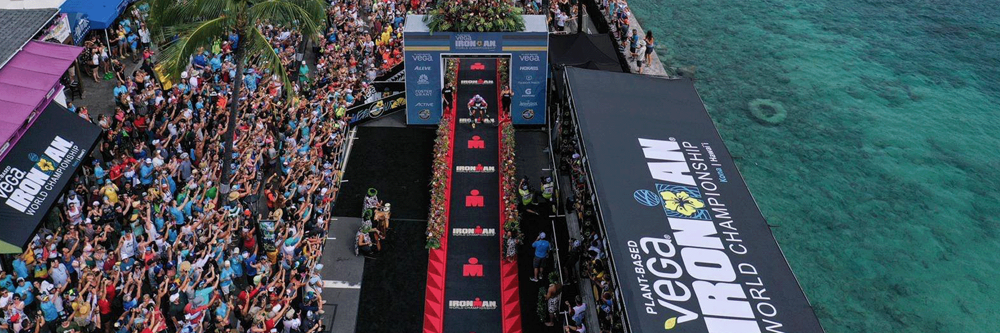

**********************************************
# Ironman Kona 2019
**********************************************

#### Author: Chelsea Zaloumis
#### Galvanize DSI Capstone 1
*Last update: 7/20/2020*

# Background & Motivation

The triathlon is arguably one of the most extreme and mentally taxing endurance sport competitions. Athletes train for years to complete the one-day competition consisting of a 2.4-mile (3.86 km) swim, a 112-mile (180.25 km) bicycle ride and a marathon 26.22-mile (42.20 km) run, raced in that order. Because a traithlon has three separate endurance sports, it begs the question, what comprises a strong Ironman athlete?

Every year since 1978, the World's craziest endurance athletes compete in the Kona Ironman World Championship (2020 being a COVID-exception). My goal is to explore the 2019 Ironman World Championship Results to determine if athletes hailing from specific backgrounds are more likely to perform well in an Ironman triathlon.

# Data

Kaggle has a dataset that includes the 2019 Ironman World Championship Results by athlete and includes the country they are representing, their category (Professional or Age Group), their overall placing, finish time, and swim / T1 / bike / T2 / run splits. 

# Exploratory Data Analysis

After importing my data using Spark, I quickly converted my data to pandas and using timecleaning.py, converted all timedate data types into minutes. I continued cleaning my data by eliminating athletes who did not finish race events and were therefore disqualified.

My first question was, do pro athletes have significantly different event split times based on their gender? Below are scatter plots for pro athletes on the left, and all amateurs on the right, by event type.

 

 

 

 

## References
Dataset: https://www.kaggle.com/andyesi/2019-ironman-world-championship-results

- - -
* notes *
-who is interested in this data?
-sponsors for up and coming athletes? sponsoring high ranking amateurs => more exposure and approachability
